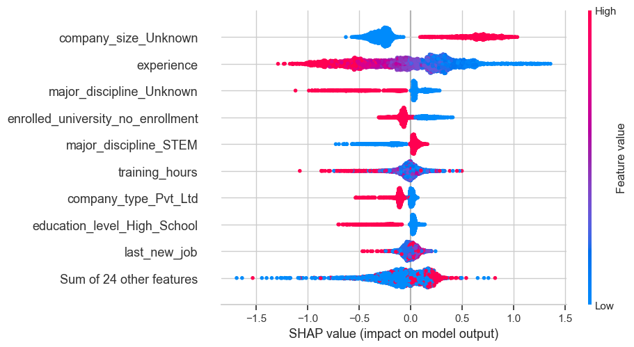
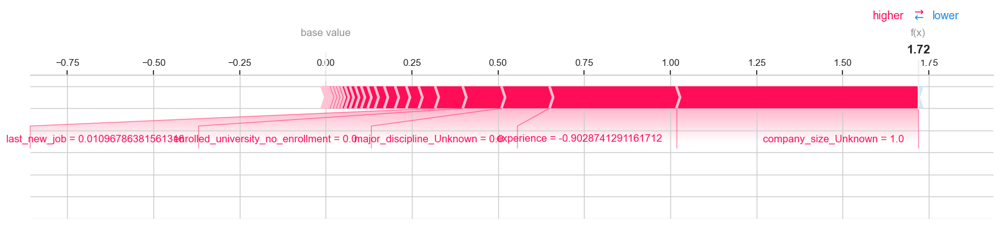

# Microsoft Azure Talent Predictor 🔮
**Predict which job seekers are likely to seek new employment — powered by XGBoost, SHAP, and Azure-ready ML deployment**

---

## 🧠 Problem Statement

Talent retention is a billion-dollar problem. This project addresses that by predicting whether a candidate will leave their current job using historical data on experience, education, and employer characteristics. The model is trained on **19,158 real-world profiles**.

---

## 💡 Key Features

- ✅ **Binary Classification**: Predict if a candidate is `Changing` or `Not Changing` jobs.
- 📊 **Model Explainability**: SHAP visualizations for individual and global predictions.
- 🖥️ **Real-time Prediction API**: Built with Flask for local or cloud deployment.
- 🌐 **Azure-Ready**: Fully packaged for Azure ML deployment using `score.py` and `env.yml`.

---

## 🚀 Performance Overview

| Metric         | XGBoost Model |
|----------------|----------------|
| **Accuracy**   | 67.6%          |
| **F1 Score**   | 0.51           |
| **Recall**     | 0.68 (class 1) |
| **Precision**  | 0.41 (class 1) |
| **Samples**    | 3,832 test rows|

The model **improved recall from 0.24 → 0.68** over baseline logistic regression by switching to **XGBoost** and engineering robust features. The goal was to reduce false negatives (missed job changers) — and we succeeded.

---

## 📈 Visual Insights

### 🔍 Feature Importance (Random Forest)
Shows which factors matter most in job change prediction.


---

### 📉 Confusion Matrix (Random Forest)
Class distribution in predictions:


---

### 📉 Confusion Matrix (XGBoost)
Class distribution in predictions:


---

### 🧠 SHAP Summary (XGBoost)
Global interpretability with SHAP values:



---

### 🔍 Individual Prediction Explanation (SHAP Force Plot)

This breakdown helps HR understand why a specific person may switch:



---

## 🛠️ Tech Stack

| Layer             | Tools Used                             |
|------------------|-----------------------------------------|
| Language          | Python 3.10                             |
| ML Algorithms     | XGBoost, Random Forest                  |
| Preprocessing     | pandas, sklearn, OneHotEncoder, StandardScaler |
| Deployment        | Flask (local API), Azure-ready config   |
| Explainability    | SHAP                                    |
| DevOps & Packaging| `requirements.txt`, `env.yml`, `score.py` |

---

## ⚙️ Usage

### 🔬 1. Jupyter Notebook Exploration

All preprocessing, training, and model evaluations are in:

```bash
notebooks/01_data_exploration.ipynb
```

---

### 🚀 2. Run Prediction API Locally

```bash
cd flask_app
python app.py
```

Send a POST request to:  
`http://127.0.0.1:5000/predict`  
using `sample.json` or your own JSON sample.

---

### ☁️ 3. Azure ML Ready

- `azure/score.py`: Inference script
- `azure/env.yml`: Conda environment
- `azure/deploy.md`: Setup instructions (simulated)

---

## 📁 Project Structure (Folders)

The project is organized for professional deployment, testing, explainability, and cloud readiness. See folders: `flask_app`, `azure`, `shap`, `model`, `data`, and `notebooks`.

---

## 🏁 Outcomes & Impact

- ⚡ **+185% improvement** in recall (from 0.24 → 0.68)
- ✅ Deployable via Flask API or Azure ML
- 🔎 Fully explainable with SHAP, making it **HR-auditable**
- 🔁 Scalable architecture: modular training, inference, and testing
- 🎯 Developed to demonstrate Microsoft-level software engineering in ML

---

## 👨‍💻 Author

**Mudit Mayank Jha**  
Computer Science @ UWI • Exchange Student @ University of Richmond  